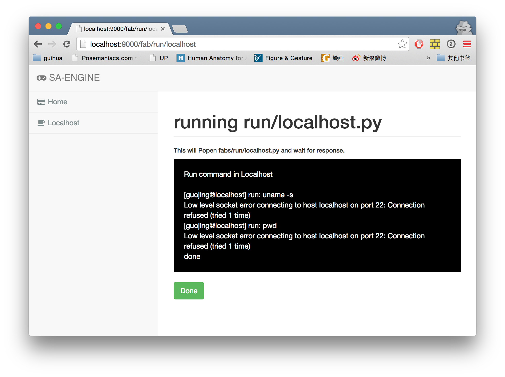

This is a very simple web run fab files for now.

Init env
----

run:

    virtualenv venv
    source venv/bin/activate

install pip:

    pip install -r requirements.txt
    pip install -r requirements-dev.txt

init env:

    cp .env.example .env

honcho start:

    honcho start

Web:
----

Just a example of localhost.py.

Run files
----

go to `http://localhost:9000/fab/run/localhost` to run file `fabs/run/localhost.py`, you could put your fabric files in to fabs folder.

    http://localhost:9000/fab/xxx/yyy

will run

    fabs/xxx/yyy.py

Deploy
----

nginx: make sure your nginx support stream response.
gunicorn: make sure your gunicorn support stream response or use `-k eventlet --graceful-timeout 600 --timeout 600` paras.
